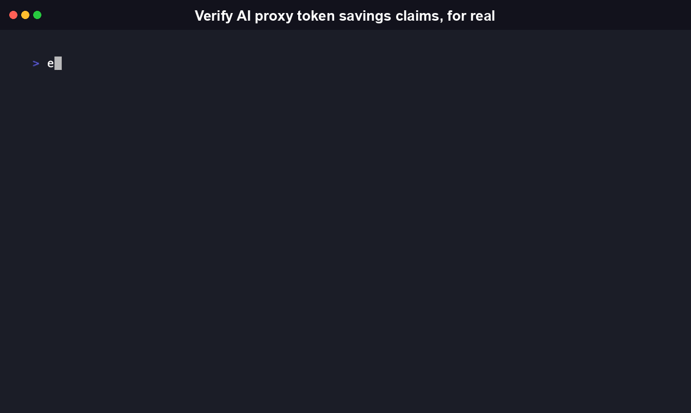
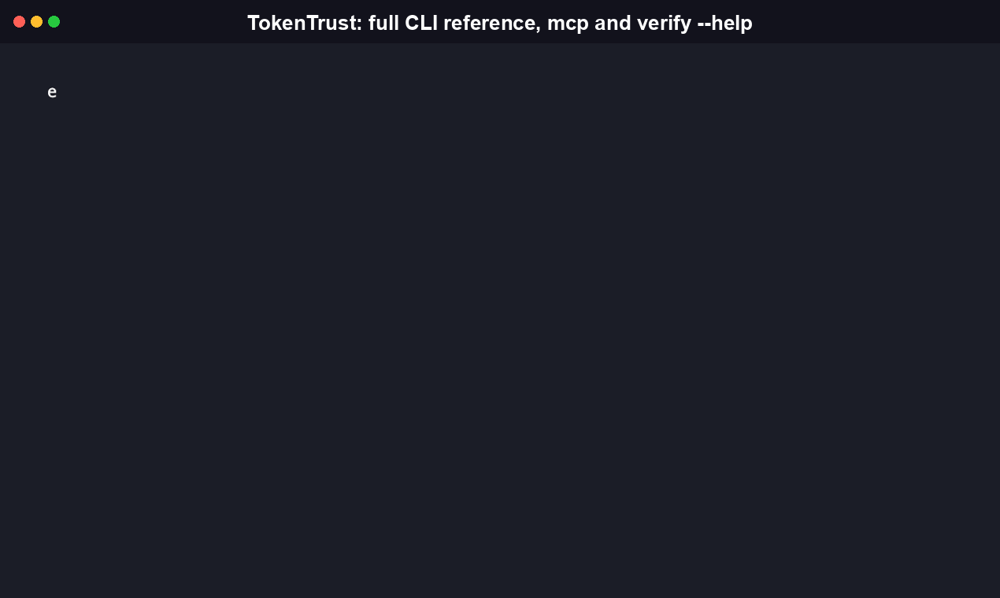

<div align="center">



# TokenTrust

Vendor-neutral CLI that independently verifies the token and cost savings AI-coding-agent
context-reduction proxies actually deliver, by running the proxy for real against a labeled
task corpus instead of trusting the maintainer's own number.

[](https://github.com/RudrenduPaul/TokenTrust-CLI/actions/workflows/ci.yml)
[](./LICENSE)
[](https://www.npmjs.com/package/tokentrust-cli)
[](https://pypi.org/project/tokentrust-cli/)

</div>

## Install

TokenTrust ships as two complementary, equally first-class distributions: an npm package for
Node.js toolchains and a PyPI package for Python toolchains. Both install a `tokentrust` command
with the identical CLI surface, the same TT01-TT05 verification categories, and the same bundled
task corpus, so pick whichever matches your existing stack.

**npm (Node.js):**

```sh
npx tokentrust-cli verify --proxy rtk
```

No clone, no local build. `npx` fetches the published package and runs it directly. To install
it as a dependency instead: `npm install -g tokentrust-cli`.

**pip (Python):**

```sh
pip install tokentrust-cli
tokentrust verify --proxy rtk
```

See [python/README.md](./python/README.md) for the Python package's full documentation,
including a note on the one real behavioral difference between the two: the npm package's
`js-tiktoken` dependency bundles its tokenizer data for fully offline use, while the Python
package's `tiktoken` dependency fetches and caches that same public data on first use.

Real output from that exact command, run against this repo's own bundled task corpus:

```
$ npx tokentrust-cli verify --proxy rtk

TokenTrust v0.1 -- Token/Context-Reduction Claims Verification
Proxy: rtk 0.43.0 | Repo: TokenTrust | Task corpus: 23 labeled tasks

[MEASURED] TT01 Compression Ratio
  Claimed (rtk README): up to 70% context reduction
  Measured (this repo, this corpus): 60.6% average reduction across 23 tasks
  Range: 0.0% ("verify-go-build-filter") to 95.4% ("verify-git-log-filter")

[MEASURED] TT02 Cost-Savings Delta
  Baseline (uncompressed): $0.02 across 23 tasks @ claude-5-sonnet pricing
  Compressed (rtk-proxied): $0.00 across 23 tasks
  Actual savings: 77.0% ($0.01) -- vs. claimed 70% ceiling

[FAIL]  TT03 Never-Worse Output Guard
  2/23 tasks regressed in task-completion diff vs. uncompressed baseline

[PASS]  TT05 Version-Drift Regression Check
  No prior verified baseline for rtk on this repo -- this run establishes the first baseline.

Summary: 77.0% measured cost savings (claimed: up to 70%) -- see full report
```

That's a real run's output, not a hand-typed example -- `npx tokentrust-cli` invokes the exact
same `dist/cli.js` entry point (the `tokentrust` command name is unchanged), so it reproduces on
your machine with no clone required.

## Table of contents

- [Why this exists](#why-this-exists)
- [What it measures](#what-it-measures)
- [Commands](#commands)
- [Agent-native / MCP](#agent-native--mcp)
- [Proxy support](#proxy-support)
- [How it compares](#how-it-compares)
- [What is TokenTrust, and why does it exist](#what-is-tokentrust-and-why-does-it-exist)
- [Real-world validation](#real-world-validation)
- [Python package](#python-package)
- [FAQ](#faq)
- [Contributing](#contributing)
- [License](#license)

## Why this exists

Context-reduction proxies (`rtk`, `headroom`, and others) publish compression and
cost-savings numbers in their own READMEs. Those numbers come from the maintainer's own
benchmark, on the maintainer's own workload, with nobody outside the project checking the math.
That's not an accusation. It's just how every proxy in this space currently reports its own
numbers, and a maintainer benchmarking their own tool isn't running an adversarial test.

The gap shows up in the proxies' own issue trackers:

- [`rtk#839`](https://github.com/rtk-ai/rtk/issues/839), an open, 5-repo, 2,100-measurement
  empirical benchmark thread asking how rtk's actual savings compare to what it claims.
- [`rtk#1935`](https://github.com/rtk-ai/rtk/issues/1935), "rtk gain hallucinates massive
  token usage and savings" (open).
- [`rtk#582`](https://github.com/rtk-ai/rtk/issues/582), "RTK Hook Increases Claude Code Costs
  by 18%," a cost regression a maintainer's own test suite didn't catch on its own. TT05 exists
  specifically to catch this class of regression before a user does.

TokenTrust doesn't compete with these proxies. It verifies them. It has no stake in whether a
proxy's claimed number holds up, and every category run prints the claimed number right next to
the measured one, so the comparison is never hidden or averaged away.

We also found and fixed a bug in our own measurement: one fixture's baseline had accidentally
been captured with `git log --oneline` instead of a true raw `git log`, which understated rtk's
real compression on that task by roughly 42 percentage points. Recapturing it honestly is why
`verify-git-log-filter` now measures 95.4%, the highest reduction in the corpus, and a real one.
[Commit e42246c](https://github.com/RudrenduPaul/TokenTrust-CLI/commit/e42246c) has the fix --
no measurement number ships without a fixture-run behind it. That same commit expanded the
corpus from 15 tasks to the current 23, which is why the actual runtime output above says "23
labeled tasks" even though one leftover help string still mentions the old count (see the FAQ).

## What it measures

- **TT01: Compression Ratio.** Actual token reduction, measured with a local tokenizer
  (`js-tiktoken`), against every task in the corpus.
- **TT02: Cost-Savings Delta.** Dollar-cost savings computed from TT01's measured token delta at
  published model pricing. Optional `--live` mode verifies the estimate against a real,
  provider-billed sample (opt-in, your own API key, gated behind `--confirm-cost`, capped at 5
  tasks by default).
- **TT03: Never-Worse Output Guard.** Checks whether a proxy's compressed output dropped content
  a task marks as required to survive compression.
- **TT04: Cross-Tool Comparative Benchmark.** Pass `--proxy` more than once and TokenTrust runs
  the identical task corpus through every named proxy side by side.
- **TT05: Version-Drift Regression Detection.** Compares a run's measured savings against the
  last-verified baseline for the same proxy/repo pair, so a silent regression across a version
  bump (like `rtk#582`) gets caught automatically.

## Commands

```
tokentrust verify --proxy <name> [options]
```

| Flag | Description |
|---|---|
| `--proxy <name>` | Proxy to verify. Repeatable, pass it more than once to run TT04's cross-tool comparison. Supported: `rtk`, `headroom`. Required. |
| `--repo <path>` | Repo to measure against. Defaults to the current directory. |
| `--tasks <file>` | Task corpus YAML file. Defaults to the bundled 23-task corpus. |
| `--live` | Sample real, provider-billed tokens for the first proxy instead of estimating from pricing tables. Requires `--confirm-cost`. |
| `--confirm-cost` | Confirms the estimated spend `--live` prints before any real API call is made. |
| `--live-max-tasks <n>` | Max tasks sampled in `--live` mode. Defaults to 5. |
| `--format <terminal\|json>` | Report output format. Defaults to `terminal`. |
| `-h`, `--help` | Show the help message and exit. |

This table (and the `tokentrust mcp` reference below) is verified against the actual `--help`
output of the published `tokentrust-cli` package, not an old copy. One known gap between
that live `--help` text and the table above is called out directly in the FAQ, instead of
silently repeating it.

Exit code is `0` when the run completes with no gated failure, non-zero otherwise. The bundled
GitHub Action's `--fail-on-regression` maps that straight to a failed CI step, so a version-drift
regression breaks the build instead of shipping silently.

Add it to CI with the bundled GitHub Action (`action/action.yml`) so verification reruns
automatically whenever a proxy's version bumps:

```yaml
- uses: RudrenduPaul/TokenTrust-CLI@main
  with:
    proxy: rtk
    fail-on-regression: 'true'
    cli-version: '<pin to the exact tokentrust-cli version you have verified against>'
```

Pin `cli-version` explicitly rather than relying on the Action's default. The Action deliberately
does not support `latest` for this input: pinning is a supply-chain safeguard, so a compromised
npm publish can't reach every workflow using this Action on its very next run without a
deliberate version bump on your part. The Action's own default for this input is an early
pre-TT04/TT05/MCP release -- omitting `cli-version` runs that old version, not the one this
README documents.

## Agent-native / MCP

TokenTrust ships in the same dual CLI + MCP-server mode as Semgrep, Trivy, Snyk, and
SonarQube: one binary, one underlying verification engine, and a second, thin front door for
agents that speak [MCP (Model Context Protocol)](https://modelcontextprotocol.io) instead of a
shell. `tokentrust mcp` starts an MCP server over stdio, exposing a single tool,
`verify_proxy_savings`, that calls straight into the same `runVerify()` engine `tokentrust
verify` uses -- no verification logic is duplicated, and the tool returns the exact structured
JSON report `--format json` already produces.

```sh
npx tokentrust-cli mcp
```



### Register it with an MCP client

Point the client's server config at this binary with the `mcp` argument. For Claude Code,
Claude Desktop, or any other client that reads an `mcpServers` block:

```json
{
  "mcpServers": {
    "tokentrust": {
      "command": "npx",
      "args": ["tokentrust-cli", "mcp"]
    }
  }
}
```

### The tool

| Field | Description |
|---|---|
| `verify_proxy_savings` | Tool name. Mirrors `verify`'s flags one-for-one, minus `--format` -- an MCP call is always machine-facing, so the tool always returns the structured JSON report. |
| `proxy` (required) | A single proxy name (`"rtk"`) or an array (`["rtk", "headroom"]`) to run the TT04 cross-tool comparison in one call. Supported: `rtk`, `headroom`. |
| `repo` | Same as `--repo`. Defaults to the MCP server process's current working directory. |
| `tasks` | Same as `--tasks`. Defaults to the bundled task corpus. |
| `live` / `confirmCost` | Same `--live`/`--confirm-cost` safety gate as the CLI: no live, provider-billed API call is made unless BOTH are explicitly `true` in the same call. Neither has a default of `true`. |
| `liveMaxTasks` | Same as `--live-max-tasks`. Defaults to 5. |

This is the tool's real, unedited `tools/list` schema, captured from a running `tokentrust mcp`
server (`inputSchema` trimmed of per-field descriptions here for length; the live server returns
them in full):

```json
{
  "name": "verify_proxy_savings",
  "title": "Verify proxy token/cost savings",
  "inputSchema": {
    "type": "object",
    "properties": {
      "proxy": { "anyOf": [{ "type": "string", "enum": ["rtk", "headroom"] }, { "type": "array", "items": { "type": "string", "enum": ["rtk", "headroom"] }, "minItems": 1 }] },
      "repo": { "type": "string" },
      "tasks": { "type": "string" },
      "live": { "type": "boolean" },
      "confirmCost": { "type": "boolean" },
      "liveMaxTasks": { "type": "integer", "exclusiveMinimum": 0 }
    },
    "required": ["proxy"]
  }
}
```

A real `tools/call` against this repo, `{"name": "verify_proxy_savings", "arguments": {"proxy":
"rtk"}}`, returns the same shape as the CLI's `--format json` output (trimmed here; the live
call returns the full `records` array with TT01/TT02/TT05 entries):

```json
{
  "content": [
    {
      "type": "text",
      "text": "{\n  \"run_id\": \"tt_2026-07-18_f88644\",\n  \"repo\": \"...\",\n  \"task_corpus_size\": 23,\n  \"proxies\": [\"rtk\"],\n  \"records\": [ /* TT01, TT02, TT05 -- same shape as `verify --format json` */ ],\n  \"tt03\": { \"rtk\": { \"pass\": false, \"regressed_count\": 2, \"task_corpus_size\": 23 } },\n  \"tt05\": { \"rtk\": { \"pass\": true, \"message\": \"No regression vs. last-verified rtk 0.43.0 baseline (stored 2026-07-18).\", \"prior_run_id\": \"tt_2026-07-18_608b74\", \"degraded\": false } }\n}"
    }
  ],
  "isError": false
}
```

`isError` is `true` (with no report) whenever the underlying `runVerify()` call itself would
have exited non-zero on the CLI -- a missing proxy binary, an invalid task corpus, or the
`--live` safety gate refusing an under-confirmed call. Progress output and the trace log
`tokentrust verify` normally prints to stdout are rerouted to stderr in MCP mode, since stdout
is the live JSON-RPC wire once a stdio transport is connected.

## Proxy support

| Proxy | Status |
|---|---|
| `rtk` | Fully supported: real subprocess-based verification (`rtk pipe --filter <name>` for stdin-shaped tasks, `rtk read -l aggressive <files>` for file-based tasks). |
| `headroom` | Recognized (`--proxy headroom` is a valid flag value), not yet supported. headroom is an HTTP proxy server, not a one-shot compression CLI, so the current subprocess-based harness can't drive it. `tokentrust verify --proxy headroom` prints a message and skips it instead of failing silently. |

## How it compares

| | What it does | Ongoing / self-serve | Verifies a specific claim |
|---|---|---|---|
| **TokenTrust** | Runs a named proxy against a labeled task corpus, measures real compression, cost, and output-quality regression, prints claimed vs. measured | Yes, runs in your own CI, on your own repo, every time a proxy version bumps | Yes, that's the whole point |
| [tokbench](https://github.com/Entelligentsia/tokbench) | Independent pilot benchmark of rtk, headroom, and lean-ctx on real agentic SDLC tasks, with raw transcripts and a pre-registered protocol | No, a single-repo pilot report, replication in progress | Yes, and rigorously: credit where it's due |
| [Langfuse](https://github.com/langfuse/langfuse), Vantage, Finout, Amnic, Revenium | LLM/AI cost observability and FinOps. Track your actual API spend across models and providers, allocate it across teams | Yes, hosted or self-hosted, ongoing | No, these track what you spent; they don't check whether a specific proxy's specific savings claim holds up |

[tokbench](https://github.com/Entelligentsia/tokbench) is the closest prior art and deserves real
credit. It's rigorous and disclosed, but its pilot scope is narrower than a first read suggests:
one repository, one task, N=1 per arm, replication runs in progress. Its own numbers on that
pilot are worth reading directly. Provider-billed input tokens against a 2.28M-token native
baseline came in at 2.89M for rtk (+27%) and 3.24M for headroom (+43%, despite headroom
genuinely compressing 342K tokens on the wire), because the agent's turn count grew even as the
per-turn payload shrank. That's a real, independently useful data point, and it's exactly the
kind of gap between "compressed" and "cheaper" TokenTrust exists to keep catching, continuously,
in your own repo rather than a single published pilot.

## What is TokenTrust, and why does it exist

TokenTrust is a command-line tool that measures whether an AI-coding-agent context-reduction
proxy's advertised token and cost savings hold up against a real, labeled task corpus, run with a
local tokenizer instead of a spreadsheet estimate. It exists because compression proxies
currently self-report their own savings numbers, and there is no independent, repeatable,
CI-native way to check one before adopting it. TokenTrust is not a proxy itself and does not
compress anything. It verifies proxies that do.

## Real-world validation

TokenTrust's own validation work has already fed back into a real, independently tracked GitHub
issue: [`rtk-ai/rtk#1313`](https://github.com/rtk-ai/rtk/issues/1313) (filed by @ChrisEdwards,
asking rtk for a lossless-only mode and an honest account of the silent failures truncation
causes in agent contexts) was originally verified as only partially addressed by rtk's existing
mechanism, because TokenTrust's own fixtures didn't yet carry the quality markers needed to prove
it either way. Extending three of TokenTrust's `pipe --filter` fixtures with real, verified
quality markers closed that gap in TokenTrust's own instrumentation, not in rtk, and let the tool
confirm, against the real rtk 0.43.0 binary and not a claim, that rtk's existing never-worse guard
mechanism already does what the issue asked for. The issue's verdict moved from partial to a
genuine, re-verified pass as a direct result. TokenTrust never touched rtk's own repository; it
got sharp enough to prove what was already true there.

## Python package

`pip install tokentrust-cli` installs the same `tokentrust` CLI as a genuine Python port, not a
wrapper around the Node binary: real Python source under [python/src/tokentrust/](./python/src/tokentrust/),
its own pytest suite, and the identical bundled 23-task corpus, copied verbatim into the wheel.
Both distributions run the same `cl100k_base` tokenizer encoding, verified to produce identical
token counts on real sample text, and both are maintained together going forward, including
`tokentrust mcp`: the Python port exposes the same `verify_proxy_savings` MCP tool, with a
byte-identical wire schema, as the npm package (see [python/README.md](./python/README.md)'s
"Agent-native / MCP" section). See
[python/README.md](./python/README.md) for install instructions, [python/docs/getting-started.md](./python/docs/getting-started.md)
for a walkthrough, and [python/docs/concepts.md](./python/docs/concepts.md) for the verification
methodology shared by both packages.

## FAQ

**What is TokenTrust, and how is it different from a context-reduction proxy like rtk or headroom?**
TokenTrust is not a proxy itself and does not compress anything. It is a vendor-neutral
verification layer: it runs a proxy like `rtk` or `headroom` as a real subprocess against a
fixed, labeled 23-task corpus, measures the actual token and dollar savings with a local
tokenizer, and prints that measured number next to the number the proxy's own README claims. The
differentiator is independence: TokenTrust has no stake in whether a proxy's claimed number holds
up, so it never averages the gap away.

**Which platforms does TokenTrust run on, and are the npm and PyPI packages the same tool?**
Both are genuine, separately maintained ports of the same tool, not one wrapping the other.
`npm install -g tokentrust-cli` (or `npx tokentrust-cli`) installs the Node.js build; `pip install
tokentrust-cli` installs a real Python port under
[python/src/tokentrust/](./python/src/tokentrust/), with its own pytest suite. Both expose the
same `tokentrust` command, the same TT01-TT05 categories, the same bundled task corpus, and the
same `cl100k_base` tokenizer encoding.

**Does TokenTrust work with AI agents directly, not just from a shell?**
Yes. `tokentrust mcp` (or `npx tokentrust-cli mcp`) starts an MCP (Model Context Protocol) server
over stdio that exposes one tool, `verify_proxy_savings`, backed by the same `runVerify()` engine
the CLI uses. Any MCP-compatible client, including Claude Code and Claude Desktop, can call that
tool and get back the same structured JSON report `--format json` produces on the command line.

**How does TokenTrust compare to tokbench, the other independent proxy benchmark?**
[tokbench](https://github.com/Entelligentsia/tokbench) is real prior art and deserves credit: a
rigorous, disclosed pilot with raw transcripts and a pre-registered protocol. Its current scope is
narrower than a first read suggests, one repository, one task, N=1 per arm, with replication in
progress. TokenTrust instead runs a 23-task corpus continuously, in your own CI, on your own repo,
every time a proxy version bumps, rather than as a single published pilot report.

**The `tokentrust verify --help` text on the npm package says the default task corpus has 15 tasks. Which is correct, 15 or 23?**
23 is correct. The bundled corpus was expanded from 15 to 23 tasks in
[commit e42246c](https://github.com/RudrenduPaul/TokenTrust-CLI/commit/e42246c), and every real
run (both npm and PyPI) reports "Task corpus: 23 labeled tasks" at the top of its output, matching
the actual `fixtures/tasks.yml` file. The npm package's `--tasks` flag help text is a leftover
string from before that expansion and hasn't been updated to say 23; the PyPI package's help text
already says 23 correctly. This affects only what the `--help` text displays, not what tasks the
CLI actually runs.

**What if `pip install tokentrust-cli` fails on my Python version?**
The PyPI package declares `requires-python = ">=3.10"` in its `pyproject.toml`, so `pip` will
refuse to install it on Python 3.9 or older. Upgrade to Python 3.10, 3.11, 3.12, or 3.13 (the
versions the package is tested against), or use the npm package instead, which only requires
Node.js 18 or newer.

**Can I use TokenTrust commercially, and do I need to attribute it?**
Yes. TokenTrust is licensed Apache-2.0 (see [LICENSE](./LICENSE)), which permits commercial use,
modification, and distribution, including inside closed-source products, as long as you keep the
license and copyright notice and note any changes you made to the source itself.

**Does TokenTrust modify my code or my proxy's compressed output?**
No. It runs the proxy as a real subprocess against fixture tasks, captures the output, and
measures it. Nothing in your repo or the proxy's configuration is changed.

**Can TokenTrust verify a proxy's live, provider-billed cost instead of an estimate?**
Yes, with `--live --confirm-cost`, capped at 5 tasks by default via `--live-max-tasks`. It uses
your own API key and never runs a real charge without printing the estimated spend first.

**Is TokenTrust importable as a library, or is it CLI-only?**
CLI-only today. Neither the npm package nor the PyPI package ships a documented, importable
public API: the npm `package.json` lists a `main` entry that points at a file the published
package doesn't actually contain, and the PyPI package's top-level module only exports a version
string. Use the `tokentrust` command or the `verify_proxy_savings` MCP tool; there is no
supported way to `import`/`require` this package's verification logic directly yet.

## Contributing

See [CONTRIBUTING.md](./CONTRIBUTING.md) for the project layout, how to add a verification
category or fixture task, and the coverage bar every category change is held to, for both the
npm and PyPI packages.

## License

Apache-2.0. See [LICENSE](./LICENSE).
